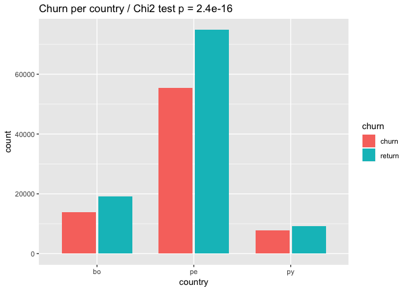
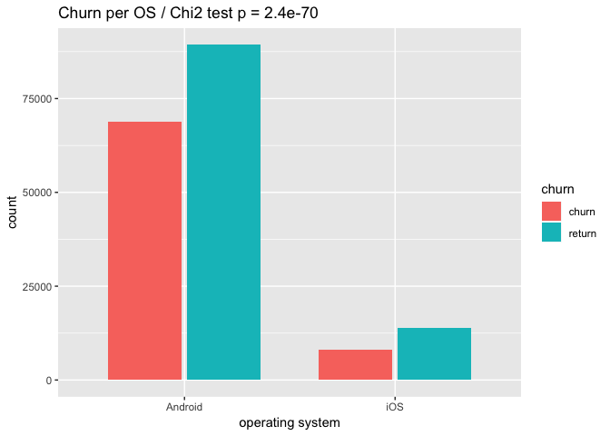
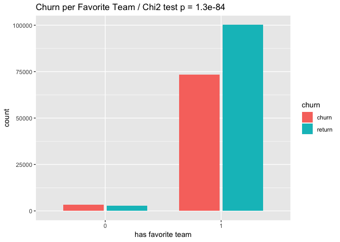
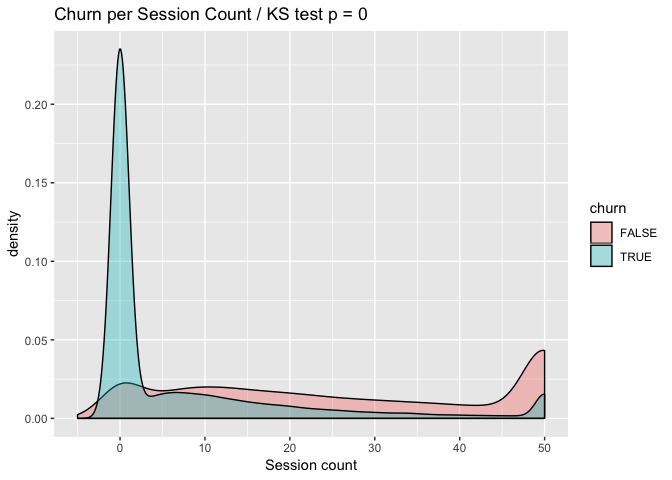
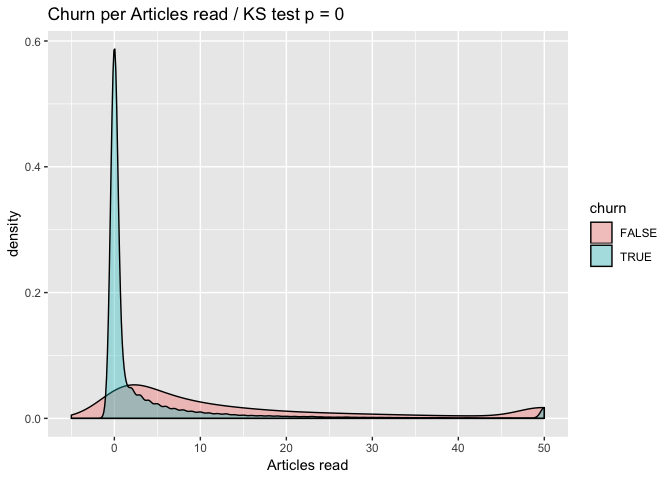
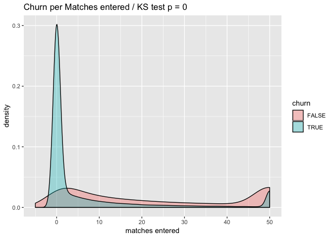
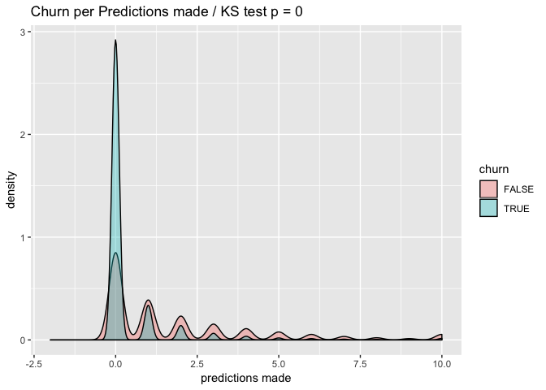
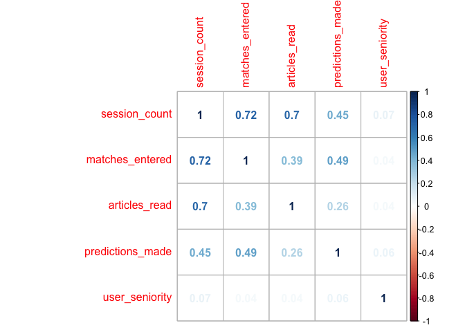
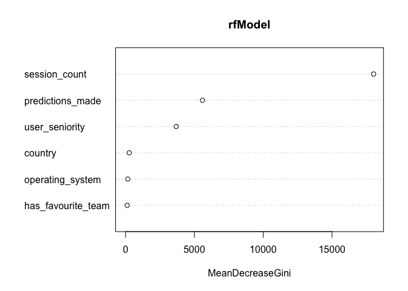

Coding Challenge OneFootball
================
Pieter Vandromme
9/9/2018

Understanding and predicting churn rates of users is a major problematic in the app market. Throught this assigment we will investigate the churn rate on a subset of data from OneFootball, specifically the users activity for the months of January to April 2018 for three countries in Latin America.

We will:

1.  load and preprocess the data
2.  calculate the monthly churn rate
3.  investigate the features correlation with churn
4.  model the churn per user
5.  predict the churn for May 2018

Data Wrangling and Pre-processing
---------------------------------

The data used are stored in the file `user.activity.csv`.

``` r
userAct <- read.csv(file = "../data/user_activity.csv", header = TRUE)
userAct <- as.tibble(userAct) # improve the speed
```

Let's make some quick modification on data to work with them:

``` r
userAct$predictions_made[is.na(userAct$predictions_made)] = 0
userAct$month_at <- ymd(userAct$month_at)
userAct$first_install_date <- ymd(userAct$first_install_date)
userAct$last_session_date <- ymd(userAct$last_session_date)
userAct$has_favourite_team <- as.numeric(userAct$has_favourite_team)
```

Check if there is any `NA` values:

``` r
sapply(userAct, function(x) sum(is.na(x)))
```

    ##           month_at            user_id first_install_date 
    ##                  0                  0                  0 
    ##  last_session_date            country has_favourite_team 
    ##                  0                  0                  0 
    ##   operating_system      session_count    matches_entered 
    ##                  0                  0                  0 
    ##      articles_read   predictions_made 
    ##                  0                  0

No `NA` values are found.

The data are organized by month, meaning that the same user can appear up to four times. We will separate the metadata per user in `userMeta` and remove those from the user activity data `userAct`:

``` r
userMeta <- userAct %>% select(user_id, first_install_date, country, has_favourite_team, operating_system)
userMeta <- unique(userMeta)
userAct <- userAct %>% select(-first_install_date, -country, -has_favourite_team, -operating_system)
```

We will now collect the information on activity (from `session_count`) per user and per month:

``` r
userActPerMonth <- userAct %>% mutate(month = month(month_at, label = TRUE, abbr = TRUE)) %>%
  select(user_id, month, session_count) %>%
  spread(month, session_count)
userActPerMonth <- merge(x = userActPerMonth, y = userMeta[ , c("user_id","first_install_date")], by = "user_id")
userActPerMonth <- as.tibble(userActPerMonth)
```

``` r
sample_n(userActPerMonth, 10)
```

    ## # A tibble: 10 x 6
    ##    user_id                         Jan   Feb   Mar   Apr first_install_da~
    ##    <fct>                         <int> <int> <int> <int> <date>           
    ##  1 28e293ee2d0dcf6f1016f1d20a1e~    NA    NA     2    NA 2018-03-18       
    ##  2 2989bd0e2033f75d9a7f7968c217~     4    NA    NA    NA 2018-01-28       
    ##  3 6377b861dbe47b039c54bfd79e49~    28    23    23     4 2018-01-10       
    ##  4 eb6a8477b33e9ece1924cb7668fd~    NA    NA    37    12 2018-03-01       
    ##  5 ffcd4da480fad7bc0e284df32e16~   101    55    11    NA 2017-09-09       
    ##  6 76608baa28288d3eaf69e6ffccf6~    NA    NA    15    NA 2018-02-28       
    ##  7 6540b41c6828d74eb24048166a9f~    NA    NA    NA    40 2018-04-07       
    ##  8 8e4b529976e19fa9023c9fef1db8~    NA     8    63    11 2018-02-26       
    ##  9 632d9c9e1491e8a4dad49409ebdd~    NA    NA    NA     8 2018-03-29       
    ## 10 27ffaaa7d2d0a08a223da28e62c7~    NA    15    17    NA 2018-02-22

We can see that some users take breaks in their use of the OneFootball app, they can churn for a particular month but return the month after. From `userActPerMonth` we can calculate the churn for February, March and April. The churn is calculated as the proportion of users who have downloaded the app before the first of the month and used it during that particular month. The same user can be classified as churn for February but not for March for example. Let's see the overall churn for those three months:

``` r
userFebChurn <- userActPerMonth %>% filter(first_install_date < "2018-02-01") %>%
  transmute(user_id, churn = is.na(Feb))
print(paste0("churn rate for February = ", round(sum(userFebChurn$churn) / nrow(userFebChurn) * 100,2), "%"))
```

    ## [1] "churn rate for February = 38.96%"

``` r
userMarChurn <- userActPerMonth %>% filter(first_install_date < "2018-03-01") %>%
  transmute(user_id, churn = is.na(Mar))
print(paste0("churn rate for March = ", round(sum(userMarChurn$churn) / nrow(userMarChurn) * 100,2), "%"))
```

    ## [1] "churn rate for March = 48.78%"

``` r
userAprChurn <- userActPerMonth %>% filter(first_install_date < "2018-04-01") %>%
  transmute(user_id, churn = is.na(Mar))
print(paste0("churn rate for April = ", round(sum(userAprChurn$churn) / nrow(userAprChurn) * 100,2), "%"))
```

    ## [1] "churn rate for April = 40.17%"

As our calculation of the churn takes into account all users who have installed the app before the 1<sup>st</sup> of the month it includes users who have definitely stopped using the app and therefore should increase over time. However on this subset we can't know if a user is in that case and we have seen that some are returning to the app after a one (or more) month break. It is interesting to note that the churn rate has decreased between March and April, probably due to an increase in football overall activity approaching the end of the season.

To investigate the churn rate we will organize our data on a monthly basis. For each month we will gather the activity of users who had the app installed prior to this month. We will gather their activity of the month before. We could have also tried to gather the activity of two and three months before to investigate in more details the users who are returning after a break but our dataset being limited to 4 months we won't have enough data to do so. It is more relevant for the present assignment to work on a monthly basis and investigate how the activity within a particular month is related to the churn of the next month. We will also add a new feature `user_seniority` calculated as the time, in days, since the user has installed the app, counting from the 1<sup>st</sup> of the month. If `user_seniority` is lower than ~30 days then it means that the user installed the app the month before.

``` r
# for february
temp.df <- userAct %>% filter(user_id %in% userFebChurn$user_id & month_at == "2018-01-01") %>%
  select(-month_at, -last_session_date)
userFebChurnData <- left_join(userFebChurn, userMeta, by = "user_id")
userFebChurnData <- left_join(userFebChurnData, unique(temp.df), by = "user_id")
userFebChurnData[is.na(userFebChurnData)] <- 0
# we will add the user seniority as a new colum (if it's <~30 it means that they are new user of the month)
userFebChurnData <- userFebChurnData %>% mutate(user_seniority = ymd("2018-02-01") - first_install_date)

# for March
temp.df <- userAct %>% filter(user_id %in% userMarChurn$user_id & month_at == "2018-02-01") %>%
  select(-month_at, -last_session_date)
userMarChurnData <- left_join(userMarChurn, userMeta, by = "user_id")
userMarChurnData <- left_join(userMarChurnData, unique(temp.df), by = "user_id")
userMarChurnData[is.na(userMarChurnData)] <- 0
userMarChurnData <- userMarChurnData %>% mutate(user_seniority = ymd("2018-03-01") - first_install_date)

# for April
temp.df <- userAct %>% filter(user_id %in% userAprChurn$user_id & month_at == "2018-03-01") %>%
  select(-month_at, -last_session_date)
userAprChurnData <- left_join(userAprChurn, userMeta, by = "user_id")
userAprChurnData <- left_join(userAprChurnData, unique(temp.df), by = "user_id")
userAprChurnData[is.na(userAprChurnData)] <- 0
userAprChurnData <- userAprChurnData %>% mutate(user_seniority = ymd("2018-04-01") - first_install_date)

# let's bind the months together
userMonthlyChurn <- bind_rows(userFebChurnData,userMarChurnData,userAprChurnData)
userMonthlyChurn$user_seniority <- as.numeric(userMonthlyChurn$user_seniority)

# let's clear up a bit our environment of dataframe we no longer need
rm(temp.df, userFebChurn, userFebChurnData, userMarChurn, userMarChurnData, userAprChurn, userAprChurnData)
```

We have now `userMonthlyChurn` which we can use to investigate the churn.

Exploratory Analysis
====================

We will first check the connection of each feature with churn separately.

``` r
# for countries
temp.df <- userMonthlyChurn %>%
  group_by(country) %>% summarise(return = sum(!churn), churn = sum(churn)) %>%
  mutate(perc_churn = (churn / (return+churn))*100)
print(temp.df[ , c(1,4)])
```

    ## # A tibble: 3 x 2
    ##   country perc_churn
    ##   <fct>        <dbl>
    ## 1 bo            42.0
    ## 2 pe            42.5
    ## 3 py            45.7

``` r
tbl <- as.matrix(temp.df[ ,c(2,3)])
rownames(tbl) <- temp.df$country[]
Xsq <- chisq.test(tbl)

p <- temp.df %>% gather("churn", "cases", 2:3) %>%
  ggplot(aes(x = as.factor(country), y = cases, fill = churn)) +
    geom_bar(width = 0.7, position = position_dodge(width=0.75), stat = "identity") +
    xlab("country") + ylab("count") + ggtitle(paste0("Churn per country / Chi2 test p = ",signif(Xsq$p.value,2)))

print(p)
```



We see that Peru is the country with the most users. Bolivia and Peru have a churn rate of 41.95% and 42.50% respectively while Paraguay has a churn rate of 45.70%. The Chi Square test shows that the country has a significant impact on the churn.

``` r
# for os
temp.df <- userMonthlyChurn %>%
  group_by(operating_system) %>% summarise(return = sum(!churn), churn = sum(churn)) %>%
  mutate(perc_churn = (churn / (return+churn))*100)
print(temp.df[ , c(1,4)])
```

    ## # A tibble: 2 x 2
    ##   operating_system perc_churn
    ##   <fct>                 <dbl>
    ## 1 Android                43.5
    ## 2 iOS                    37.2

``` r
tbl <- as.matrix(temp.df[ ,c(2,3)])
rownames(tbl) <- temp.df$operating_system[]
Xsq <- chisq.test(tbl)

p <- temp.df %>% gather("churn", "cases", 2:3) %>%
  ggplot(aes(x = as.factor(operating_system), y = cases, fill = churn)) +
  geom_bar(width = 0.7, position = position_dodge(width=0.75), stat = "identity") +
  xlab("operating system") + ylab("count") + ggtitle(paste0("Churn per OS / Chi2 test p = ",signif(Xsq$p.value,2)))

print(p)
```



We see that we have a large majority of our users are using Android. However the churn is lower for iOS users (37.15% vs 43.48%). The Chi square test shows that the difference is significant.

``` r
# for favorite team
temp.df <- userMonthlyChurn %>%
  group_by(has_favourite_team) %>% summarise(return = sum(!churn), churn = sum(churn)) %>%
  mutate(perc_churn = (churn / (return+churn))*100)
print(temp.df[ , c(1,4)])
```

    ## # A tibble: 2 x 2
    ##   has_favourite_team perc_churn
    ##                <dbl>      <dbl>
    ## 1                  0       54.5
    ## 2                  1       42.3

``` r
tbl <- as.matrix(temp.df[ ,c(2,3)])
rownames(tbl) <- temp.df$has_favourite_team[]
Xsq <- chisq.test(tbl)

p <- temp.df %>% gather("churn", "cases", 2:3) %>%
  ggplot(aes(x = as.factor(has_favourite_team), y = cases, fill = churn)) +
  geom_bar(width = 0.7, position = position_dodge(width=0.75), stat = "identity") +
  xlab("has favorite team") + ylab("count") + ggtitle(paste0("Churn per Favorite Team / Chi2 test p = ",signif(Xsq$p.value,2)))

print(p)
```



We see that most of our users chose a favorite team. Among the ones who did chose one the churn was 42.27% while it was 54.54% for the ones who didn't chose a favorite team. The Chi square test shows that the difference is significant.

For numeric features we will display the density distributions of churn and non-churn users. To assess if the two distributions are significantly different we will use the Kolmogorov-Smirnof (KS) test (which do not assume the normality of the data). As the distributions have long tails we will set a maximum value for improved clarity in the graphs.

``` r
isChurn <- userMonthlyChurn$churn

# for session count
temp.df <- select(userMonthlyChurn, churn, x = session_count)
kolTest <- ks.test(x = temp.df$x[isChurn],
                   y = temp.df$x[!isChurn],
                   alternative = "g")

temp.df$x[temp.df$x>50] <- 50
p <- temp.df %>%
  ggplot(aes(x = x, fill = churn, group = churn)) +
  geom_density(adjust = 1.5, alpha = 0.35) +
  xlim(-5,50) + xlab("Session count") +
  ggtitle(paste0("Churn per Session Count / KS test p = ",signif(kolTest$p.value,2)))

print(p)
```



We see here that a large proportion of churn users didn't used the app the previous month. However, some who didn't used the month before were active (users returning after a break). We also see that the users who have used the app a lot are less likely to churn. It is interesting to not that some heavy users did churn. The KS test shows a significant difference between the two distributions.

``` r
# for articles read
temp.df <- select(userMonthlyChurn, churn, x = articles_read)
kolTest <- ks.test(x = temp.df$x[isChurn],
                   y = temp.df$x[!isChurn],
                   alternative = "g")

temp.df$x[temp.df$x>50] <- 50
p <- temp.df %>%
  ggplot(aes(x = x, fill = churn, group = churn)) +
  geom_density(adjust = 2, alpha = 0.35) +
  xlim(-5,50) + xlab("Articles read") +
  ggtitle(paste0("Churn per Articles read / KS test p = ",signif(kolTest$p.value,2)))

print(p)
```



``` r
# for matches entered
temp.df <- select(userMonthlyChurn, churn, x = matches_entered)
kolTest <- ks.test(x = temp.df$x[isChurn],
                   y = temp.df$x[!isChurn],
                   alternative = "g")

temp.df$x[temp.df$x>50] <- 50
p <- temp.df %>%
  ggplot(aes(x = x, fill = churn, group = churn)) +
  geom_density(adjust = 2, alpha = 0.35) +
  xlim(-5,50) + xlab("matches entered") +
  ggtitle(paste0("Churn per Matches entered / KS test p = ",signif(kolTest$p.value,2)))

print(p)
```



`articles_read` and `matches_entered` show a similar distribution between churn and returning users than `session_count`. The KS test is significant for both of them.

``` r
# for prediction made
temp.df <- select(userMonthlyChurn, churn, x = predictions_made)
kolTest <- ks.test(x = temp.df$x[isChurn],
                   y = temp.df$x[!isChurn],
                   alternative = "g")

temp.df$x[temp.df$x>10] <- 10
p <- temp.df %>%
  ggplot(aes(x = x, fill = churn, group = churn)) +
  geom_density(adjust = 1, alpha = 0.35) +
  xlim(-2,10) + xlab("predictions made") +
  ggtitle(paste0("Churn per Predictions made / KS test p = ",signif(kolTest$p.value,2)))

print(p)
```



We observe a similar pattern for `predictions_made` as well.

``` r
# for user seniority
temp.df <- userMonthlyChurn %>% select(churn, x = user_seniority)
kolTest <- ks.test(x = temp.df$x[isChurn],
                   y = temp.df$x[!isChurn],
                   alternative = "g")

p <- temp.df %>%
  ggplot(aes(x = x, fill = churn, group = churn)) +
  geom_density(adjust = 1, alpha = 0.35) +
  xlab("predictions made") +
  ggtitle(paste0("Churn per user seniority / KS test p = ",signif(kolTest$p.value,2)))

print(p)
```


And finally for `user_seniority` the distribution is quite different, with an higher churn for users who have used the app for a longer period. New users are less likely to churn. The KS test is also significant.

feature selection
=================

It seems that some of our numeric variables are correlated, let's check it:

``` r
corr.matrix <- cor(userMonthlyChurn[ ,c("session_count","matches_entered","articles_read","predictions_made","user_seniority")])
corrplot(corr.matrix, method = "number")
```



The feature `session_count` is correlated with `matches_entered` and `articles_read` (R = ~0.70 for both). However `matches_entered` and `articles_read` aren't strongly correlated between each other (0.39). It seems reasonable to keep all the numeric features for modelling the churn.

We have seen that all categorical variables have a significant impact on the churn, we will also keep all of them.

Modelling the churn
===================

Let's first select only the data we need and split it between a training and a testing set.

``` r
churn.data <- userMonthlyChurn %>%
  select(-user_id, -first_install_date)

set.seed(1984)
intrain <- createDataPartition(churn.data$churn, p = 0.8, list = FALSE)
training <- churn.data[intrain,]
testing <- churn.data[-intrain,]
```

We will test both a logistic and a random forest regressions.

logistic regression model
-------------------------

``` r
logModel <- glm(churn ~ ., family = binomial(link = "logit"), data = training)
print(summary(logModel))
```

    ## 
    ## Call:
    ## glm(formula = churn ~ ., family = binomial(link = "logit"), data = training)
    ## 
    ## Deviance Residuals: 
    ##     Min       1Q   Median       3Q      Max  
    ## -1.6746  -0.9997  -0.2873   0.9537   6.1376  
    ## 
    ## Coefficients:
    ##                       Estimate Std. Error z value Pr(>|z|)    
    ## (Intercept)          6.036e-01  3.373e-02  17.894  < 2e-16 ***
    ## countrype            4.547e-02  1.566e-02   2.903   0.0037 ** 
    ## countrypy            1.076e-01  2.367e-02   4.543 5.54e-06 ***
    ## has_favourite_team  -1.912e-01  3.098e-02  -6.170 6.83e-10 ***
    ## operating_systemiOS -2.150e-01  1.909e-02 -11.262  < 2e-16 ***
    ## session_count       -4.466e-02  6.153e-04 -72.585  < 2e-16 ***
    ## matches_entered      3.200e-03  2.382e-04  13.430  < 2e-16 ***
    ## articles_read        1.119e-03  5.756e-04   1.944   0.0519 .  
    ## predictions_made    -1.721e-01  5.557e-03 -30.969  < 2e-16 ***
    ## user_seniority       1.724e-03  8.814e-05  19.562  < 2e-16 ***
    ## ---
    ## Signif. codes:  0 '***' 0.001 '**' 0.01 '*' 0.05 '.' 0.1 ' ' 1
    ## 
    ## (Dispersion parameter for binomial family taken to be 1)
    ## 
    ##     Null deviance: 196638  on 144063  degrees of freedom
    ## Residual deviance: 162734  on 144054  degrees of freedom
    ## AIC: 162754
    ## 
    ## Number of Fisher Scoring iterations: 5

To test the importance of features we will perform a Chi square Anova sequential test. This test starts with the simplest model and sequentially add the features to assess the improvement of the model

``` r
anova(logModel, test = "Chisq")
```

    ## Analysis of Deviance Table
    ## 
    ## Model: binomial, link: logit
    ## 
    ## Response: churn
    ## 
    ## Terms added sequentially (first to last)
    ## 
    ## 
    ##                    Df Deviance Resid. Df Resid. Dev  Pr(>Chi)    
    ## NULL                              144063     196638              
    ## country             2       58    144061     196580 2.283e-13 ***
    ## has_favourite_team  1      318    144060     196262 < 2.2e-16 ***
    ## operating_system    1      242    144059     196020 < 2.2e-16 ***
    ## session_count       1    31744    144058     164276 < 2.2e-16 ***
    ## matches_entered     1       13    144057     164263 0.0003337 ***
    ## articles_read       1        3    144056     164260 0.0943718 .  
    ## predictions_made    1     1142    144055     163118 < 2.2e-16 ***
    ## user_seniority      1      384    144054     162734 < 2.2e-16 ***
    ## ---
    ## Signif. codes:  0 '***' 0.001 '**' 0.01 '*' 0.05 '.' 0.1 ' ' 1

We see that the three features that improved our logistic model the most are `session_count`, `predictions_made`, and `user_seniority`.

We can now apply our model on the testing set and check the accuracy of the classification.

``` r
logFit <- predict(logModel, newdata = testing, type = "response")

caret::confusionMatrix(as.factor(logFit > 0.5), as.factor(testing$churn))
```

    ## Confusion Matrix and Statistics
    ## 
    ##           Reference
    ## Prediction FALSE  TRUE
    ##      FALSE 14809  3608
    ##      TRUE   5826 11772
    ##                                           
    ##                Accuracy : 0.7381          
    ##                  95% CI : (0.7335, 0.7426)
    ##     No Information Rate : 0.573           
    ##     P-Value [Acc > NIR] : < 2.2e-16       
    ##                                           
    ##                   Kappa : 0.4744          
    ##  Mcnemar's Test P-Value : < 2.2e-16       
    ##                                           
    ##             Sensitivity : 0.7177          
    ##             Specificity : 0.7654          
    ##          Pos Pred Value : 0.8041          
    ##          Neg Pred Value : 0.6689          
    ##              Prevalence : 0.5730          
    ##          Detection Rate : 0.4112          
    ##    Detection Prevalence : 0.5114          
    ##       Balanced Accuracy : 0.7415          
    ##                                           
    ##        'Positive' Class : FALSE           
    ## 

We see that our model has 73.81% accuracy on the testing set. From the confusion matrix we see that 5826 cases (16.18%) of non churn were predicted as churn and that 3608 (10.02%) of churn users were predicted as non churn. For further analysis it will be interesting to look at the probabilities given by the logistic model. The logistic model output for each user a value between 0 and 1 which is, in our case, the probability of churn. It is then possible to classify users by they likelyhood of churning.

It is worth noting that if we move the threshold to 0.6 instead of 0.5, that is a user will be classified as churn if the probability of churning is greater than 60% instead of 50% then the accuracy of the model improved to 76.33% and the users wrongly classified as churn decrease from 5826 (16.18%) cases to 2729 (7.58%). However the number of users wrongly classified as non churn increased.

Random Forest Classification
----------------------------

For the Random Forest model, to simplify, we won't use the features `matches_entered` and `article_read` as it appears redundant of `session_count`.

``` r
training$churn <- as.factor(training$churn)
testing$churn <- as.factor(testing$churn)
rfModel <- randomForest(
  churn ~ session_count + has_favourite_team + country + operating_system + user_seniority + predictions_made,
  data = training, ntree = 50, mtry = 2)
```

``` r
print(rfModel)
```

    ## 
    ## Call:
    ##  randomForest(formula = churn ~ session_count + has_favourite_team +      country + operating_system + user_seniority + predictions_made,      data = training, ntree = 50, mtry = 2) 
    ##                Type of random forest: classification
    ##                      Number of trees: 50
    ## No. of variables tried at each split: 2
    ## 
    ##         OOB estimate of  error rate: 21.99%
    ## Confusion matrix:
    ##       FALSE  TRUE class.error
    ## FALSE 75631  6910  0.08371597
    ## TRUE  24765 36758  0.40253239

Let's check for the importance of variables in the Random Forest model:

``` r
varImpPlot(rfModel, sort = TRUE)
```



The most important features used in the Random Forest model are `session_count`, `predictions_made` and `user_seniority`.

We can now apply the Random Forest model to the testing set to assess its accuracy:

``` r
rfFit <- predict(rfModel, newdata = testing)
caret::confusionMatrix(rfFit, as.factor(testing$churn))
```

    ## Confusion Matrix and Statistics
    ## 
    ##           Reference
    ## Prediction FALSE  TRUE
    ##      FALSE 18934  6181
    ##      TRUE   1701  9199
    ##                                           
    ##                Accuracy : 0.7811          
    ##                  95% CI : (0.7768, 0.7854)
    ##     No Information Rate : 0.573           
    ##     P-Value [Acc > NIR] : < 2.2e-16       
    ##                                           
    ##                   Kappa : 0.5355          
    ##  Mcnemar's Test P-Value : < 2.2e-16       
    ##                                           
    ##             Sensitivity : 0.9176          
    ##             Specificity : 0.5981          
    ##          Pos Pred Value : 0.7539          
    ##          Neg Pred Value : 0.8439          
    ##              Prevalence : 0.5730          
    ##          Detection Rate : 0.5257          
    ##    Detection Prevalence : 0.6973          
    ##       Balanced Accuracy : 0.7578          
    ##                                           
    ##        'Positive' Class : FALSE           
    ## 

The Random Forest model has an overall better accuracy than the Logistic model (78.16% vs 73.81%). A total of 1756 cases of non churn users were wrongly predicted (4.88%) and 6109 cases of churn users were wrongly predicted (16.96%).

Model Selection
---------------

Both Models showed a prediction accuracy in the range of 75%, the Random Forest model being the most accurate (4.35% more than the Logistic model). These two models are widely used for classification, the logistic one being more specific to the classification between two groups (here, churn vs non-churn).

For the Random Forest model I had to limit the number of trees to 50 for computation issues. Adding more trees (typically around 400) should improve further its accuracy. For the current assigment, as it is computationally heavy to run the Random Forest Model and the gain in accuracy is limited, we will use the Logistic model to estimate the churn of users for May 2018.

We will then run the Logistic model on all our data:

``` r
logModel <- glm(churn ~ ., family = binomial(link = "logit"), data = churn.data)
```

To avoid overfitting and improve the generalization of our model we should perform some bootstrapping. This can be done with the `boot` library in `R`. It is, however, computationally intensive and I believe that it is beyond the scope of this assignment.

Estimation of User Churn
========================

We will first collect the data on all users active before the 1<sup>st</sup> of May 2018 and gather their activity for April 2018.

``` r
userApr <- userActPerMonth %>% filter(first_install_date < "2018-05-01") %>% select(user_id)

temp.df <- userAct %>% filter(user_id %in% userApr$user_id & month_at == "2018-04-01") %>%
  select(-month_at, -last_session_date)
userAprData <- left_join(userApr, userMeta, by = "user_id")
userAprData <- left_join(userAprData, unique(temp.df), by = "user_id")
userAprData[is.na(userAprData)] <- 0
userAprData <- userAprData %>% mutate(user_seniority = ymd("2018-05-01") - first_install_date)
userAprData$user_seniority <- as.numeric(userAprData$user_seniority)
```

We can now apply the Logistic model to predict the churn for May:

``` r
logPredMay <- predict(logModel, newdata = userAprData)
logPredMayTF <- logPredMay > 0.5
```

And save the results in `user_classified.csv`

``` r
userClass <- data.frame(userMeta$user_id,logPredMayTF)
names(userClass) <- c("user_id","churn_may_estimate")
write.csv(userClass,"../data/user_classified.csv")
```

The column `churn_may_estimate` is `TRUE` if the user is predicted to churn and `False` otherwise.

Analysis of Churn Estimate for May
----------------------------------

We have estimated the churn per user for the month of May 2018. Let's look at the churn rates:

``` r
# churn rate total
print(paste0("total user churn for May 2018 = ", round(sum(userClass$churn_may_estimate) / nrow(userClass) * 100, 2), "%"))
```

    ## [1] "total user churn for May 2018 = 48.07%"

``` r
# churn rate for users active in April
isActApr <- !is.na(userActPerMonth$Apr)
print(paste0("Active April users churn for May 2018 = ", round(sum(userClass$churn_may_estimate[isActApr]) / nrow(userClass[isActApr, ]) * 100, 2), "%"))
```

    ## [1] "Active April users churn for May 2018 = 2.48%"

``` r
# churn rate for users non-active in April
print(paste0("non-Active April users churn for May 2018 = ", round(sum(userClass$churn_may_estimate[!isActApr]) / nrow(userClass[!isActApr, ]) * 100, 2), "%"))
```

    ## [1] "non-Active April users churn for May 2018 = 93.51%"

The logistic model predicted an overall churn for May of 48.07%. Within the users who were active in April, the model predicts that only 2.48% of them will churn which is lower than the rate measured in the data for the previous months of 24.05%. Among the users who weren't active in April, the model predicts that 93.51% of them will churn, compared to the 80.46% rate measured in the data.

Discussion
==========

We have successfully loaded and pre-processed the data, calculated the churn per user, explored the correlation between the various features and the churn and have been able to built statistical models to predict the future churn per user.

Due to the structure and time frame of the data we had available we decided to focus on using the activity of users of the previous month to predict the churn of the upcoming month. That is, how the January activity of users will impact the churn for February, how the February activity impact the churn for March...

However, we have seen that some users are returning to the app after one or more months break (19.54% of the cases where it is measurable in our data). To analyse this behavior in more details we will have needed a longer period of records. For the scope of this assignment we weren't able to put a strong focus on this particular behavior.

From looking at the features one by one and their relation with the churn it appears that all had a significant impact. We had significantly more churn for Paraguay compared to Peru and Bolivia, we had significantly less churn for iOS users, and we had significantly less churn for users who picked a favorite team. For numeric features, we had significantly less churn for users who used the oneFootball app the most the month before (from sessions opened, matches entered, articles read and predictions made).

To account for the behavior of users according to their days of experience, we added a new feature `user_seniority` calculated as the number of days since their first install. From this feature we saw that users who have installed the app recently are less likely to churn.

We used two statistical models to predict the user churn, a Logistic model and a Random Forest classifier. The Logistic model was able to predict user churn with an accuracy of 73.81% and the Random Forest with 78.16%. In Both models the features with the highest importance in the classification were `session_count`, `predictions_made` and `user_seniority`. Other features might add redundant information (as seen with the correlation matrix) and therefore weren't important in the classification process.

It appears natural that the involvement of users in the app as measured by `session_count` is the most important feature. `predictions_made` captures another aspect of the involvement and probably a specific kind of football fan, being into not only following the news and results, but wanting to predict them. The `user_seniority` feature tells us about whether or not a user is new. It seems that new users are less likely to churn directly and will use the oneFootball app few times before converting or not to regular users.

As expected by the analysis we performed, the prediction put a strong emphasis on users who were active the month before the churn is calculated, and underestimate the churn of these users. The model also overestimate the churn of users who had taken a break in using the app.

To improve the classification we can use other approaches. For example we could classify users in various groups according to their behavior and metadata with clustering methods then apply a Naive Bayes classifier with the expected prior based on the group the user belongs to. We could also tune our existing models, notably the Random Forest. It wasn't possible to do it here due to the computationally intensive cost of this model.

Yet, improving models if the total variance isn't captured within the data measured won't be effective. To improve the effectiveness of the classification we should include relevant features to the dataset. We could include, for example:

-   acquisition\_channel: knowing if the user came from organic search or marketing campaigns could tell us more about the motivations of the user, as well as the success of marketing campaign for user retention.
-   notification\_received / opened: knowing this information will allow us to investigate different user behavior, such as users who connect directly to the app or the ones who only connect when they are reminded of the existence of oneFootball. It will also allow us to evaluate the efficiency of notifications.

Both these two new potential features can be measured, will tell us more about the users behavior and will also allow us to work on actionable insights.
